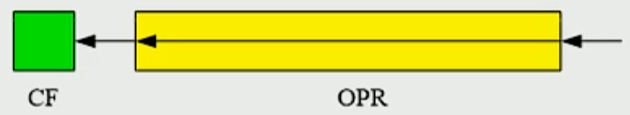
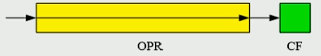
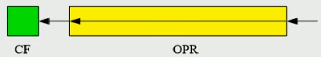
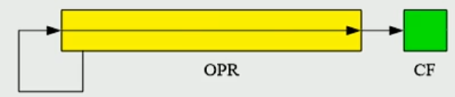
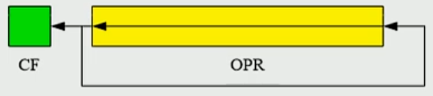
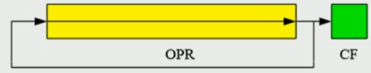
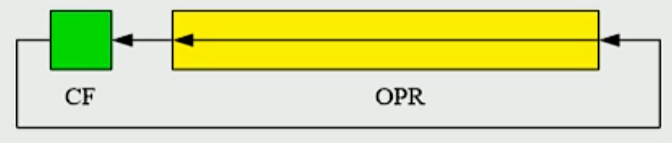
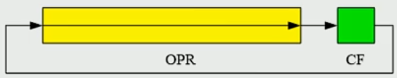

# 8086

## 寄存器

8086 有 14 个寄存器，每个都是 16 位宽：

- 通用寄存器：
  - AX：可分为 AH 和 AL。
  - BX：可分为 BH 和 BL。
  - CX：可分为 CH 和 CL。
  - DX：可分为 DH 和 DL。
  - SI
  - DI
  - BP
  - SP
- 段寄存器：
  - CS
  - DS
  - SS
  - ES
- 指令指针寄存器：IP。
- 标志寄存器：FLAGS。

  

  - CF：进/借位标志。无符号数运算产生进/借位时置 1。
  - PF：奇偶标志。结果低 8 位中 1 的个数为偶数时置 1。
  - AF：辅助进位标志。第 3 位向第 4 位产生进/借位（用于 BCD 运算）。
  - ZF：零标志。运算结果为 0 时置 1。
  - SF：符号标志。结果最高位（符号位）为 1 时置 1。
  - TF：陷阱标志。单步调试模式。
  - IF：中断允许标志。为 1 时允许响应可屏蔽中断。
  - DF：方向标志。为 0：字符串操作递增；为 1：递减。
  - OF：溢出标志。有符号数运算结果溢出时置 1。

## 寻址方式

- 立即寻址：操作数直接包含在指令中。

  ```nasm
  MOV AX, 1234H
  ```

- 寄存器寻址：操作数存放在寄存器中。

  ```nasm
  MOV AX, BX
  ```

- 直接寻址：指令中包含操作数的偏移地址。段地址默认存放在 DS。

  ```nasm
  MOV AX, [1234H]
  ```

- 寄存器间接寻址：操作数的偏移地址存放在 BX/BP/SI/DI 中。段地址默认存放在：BP → SS，BX/ SI/DI → DS。

  ```nasm
  MOV AX, [BX]
  ```

- 寄存器相对寻址：操作数的偏移地址为 BX/BP/SI/DI 与偏移量之和。段地址默认存放位置与寄存器间接寻址相同。

  ```nasm
  MOV AX, [BX+100]
  ```

- 基址变址寻址：操作数的偏移地址为 BX/BP 与 SI/DI 之和。段地址默认存放位置由 BX/BP 决定。

  ```nasm
  MOV AX, [BX+SI]
  ```

- 相对基址变址寻址：操作数的偏移地址为 BX/BP、SI/DI 与位移量之和。段地址默认存放位置由 BX/BP 决定。

  ```nasm
  MOV AX, [BP+DI+100]
  ```

## 常用汇编指令

### 算术运算指令

- `ADD`

- `ADC`

- `SUB`

- `SBB`

- `INC`

- `DEC`

- `NEG`

- `CMP`：比较，相当于 SUB 但不保存结果。

  - 无符号数比较：

    ```nasm
    CMP AX, BX
    ```

    - `AX = BX`：ZF = 1。
    - `AX ≠ BX`：ZF = 0。
    - `AX < BX`：CF = 1。
    - `AX ≥ BX`：CF = 0。
    - `AX > BX`：CF = 0 且 ZF = 0。
    - `AX ≤ BX`：CF = 1 或 ZF = 1。

- `MUL`

  ```nasm
  MUL 操作数 
  ```

  - 操作数可以是寄存器、内存单元。
  - 8 位 × 8 位：被乘数在 AL 寄存器中，乘数在操作数中，乘积在 AX 寄存器中。
  - 16 位 × 16 位：被乘数在 AX 寄存器中，乘数在操作数中，乘积在 DX:AX 寄存器中。

- `IMUL`

- `DIV`：无符号除法。

  ```nasm
  DIV 操作数 
  ```

  - 操作数可以是寄存器、内存单元。
  - 16 位 ÷ 8 位：被除数在 AX 中，除数在操作数中，商在 AL 中，余数在 AH 中。
  - 32 位 ÷ 16 位：被除数在 DX:AX 中，除数在操作数中，商在 AX 中，余数在 DX 中。

- `IDIV`

### 逻辑运算指令

- `AND`
- `OR`
- `XOR`
- `NOT`
- `TEST`：测试，相当于 AND 但不保存结果。

### 位操作指令

- `SHL`：逻辑左移。

  

- `SHR`：逻辑右移。

  

- `SAL`：算术左移。

  

- `SAR`：算术右移。

  

- `ROL`：循环左移。

  

- `ROR`：循环右移。

  

- `RCL`：带进位的循环左移。

  

- `RCR`：带进位的循环右移。

  

### 数据传送指令

- `MOV`：将源操作数的内容复制到目标操作数中。

  ```nasm
  MOV 目的操作数, 源操作数
  ```

  - 操作数可以是寄存器、内存单元、立即数。

  - 操作数不能同时是内存单元。
  - 不能用直接用立即数修改段寄存器。
  - 操作数位数必须相同。
  - `MOV` 指令不影响任何标志位。

- `IN`：从端口读入数据。

  ```nasm
  IN 目的操作数, 源操作数
  ```

  - 目的操作数只能是AL（8 位数据）、AX（16 位数据）。
  - 对于 0 ~ 255 的端口号，源操作数可以直接使用立即数；否则，必须使用 DX，端口号放在 DX 中。

- `OUT`：向端口写出数据。

### 堆栈指令

栈顶的物理地址 = SS × 16 + SP。堆栈以字为基本单位，`PUSH` 和 `POP` 只能操作 16 位数据。堆栈是从高地址向低地址增长的。

- `PUSH`：栈顶指针 SP 减 2，将操作数压入栈。

  ```nasm
  PUSH 操作数
  ```

  - 不能将立即数压栈。
  - `PUSHF`：栈顶指针 SP 减 2，将标志寄存器压入栈。

- `POP`：从栈顶取出 2 字节到操作数，SP 加 2。

  ```nasm
  POP 操作数
  ```

  - `POPF`：从栈顶取出 2 字节到标志寄存器，SP 加 2。

### 转移指令

#### 无条件转移

- 段内转移：仅修改 IP。

  - 段内直接转移：

    ```nasm
    JMP SHORT 标号
    JMP NEAR PTR 标号
    JMP 标号  ; 由编译器根据目标距离自动选择短跳转或近跳转
    ```

    - 底层跳转原理： `IP ← IP + 位移量`。对于短跳转，该位移是一个 8 位有符号数，范围 -128 ～ +127 字节；对于近跳转，该位移是一个 16 位有符号数，范围 -32768 ～ +32767 字节。

  - 段内间接转移：

    ```nasm
    JMP 寄存器
    JMP WORD PTR 内存单元
    ```

    - 底层跳转原理： `IP ← 寄存器或内存单元内容`。

- 段间转移：同时修改 CS 和 IP。

  - 段间直接转移：

    ```nasm
    JMP FAR PTR 标号
    ```

    - 底层跳转原理： `CS ← 段地址`， `IP ← 偏移地址`。

  - 段间间接转移：

    ```nasm
    JMP DWORD PTR 内存单元
    ```

    - 底层跳转原理： `CS ← 内存单元高地址处的字`， `IP ← 内存单元低地址处的字`。

#### 有条件转移

有条件跳转都是只能短跳转，即底层跳转原理为 `IP ← IP + 位移量`，该位移是一个 8 位有符号数，范围 -128 ～ +127 字节。

- `LOOP`：使用 CX 作为计数器，每次执行时先减 1，若结果不为 0，则跳转到指定标号，否则顺序执行下一条指令。

  ```nasm
  LOOP 标号
  ```

- `JCXZ`：若 `CX` 为 0，则跳转到指定标号，否则顺序执行下一条指令。

  ```nasm
  JCXZ 标号
  ```

- 基于单个标志位的跳转指令：

  | 汇编指令               | 含义                             | 测试条件 |
  | ---------------------- | -------------------------------- | -------- |
  | `JE`/`JZ`            | 等于/结果为零                  | ZF = 1   |
  | `JNE`/ `JNZ`           | 不等/结果非零                  | ZF = 0   |
  | `JS`                   | 结果为负                         | SF = 0   |
  | `JNS`                  | 结果非负                         | SF = 1   |
  | `JO`                   | 结果溢出                         | OF = 1   |
  | `JNO`                  | 结果无溢出                       | OF = 0   |
  | `JP`/`JPE`           | 结果低 8 位中 1 的个数为偶数     | PF = 1   |
  | `JNP`/`JPO`          | 结果低 8 位中 1 的个数为奇数     | PF = 0   |
  | `JB`/`JNAE`/`JC`   | 有进位或借位/小于/不大于等于 | CF = 1   |
  | `JNB` /`JAE`/`JNC` | 无进位或借位/不小于/大于等于 | CF = 0   |

- 基于无符号数比较结果的跳转指令：

  | 汇编指令               | 含义              | 测试条件         |
  | ---------------------- | ----------------- | ---------------- |
  | `JE`/`JZ`            | 等于              | ZF = 1           |
  | `JNE`/`JNZ`          | 不等于            | ZF = 0           |
  | `JB`/`JNAE`/`JC`   | 小于/不大于等于 | CF = 1           |
  | `JBE`/`JNA`          | 小于等于/不大于 | CF = 1 或 ZF = 1 |
  | `JA`/`JNBE`          | 大于/不小于等于 | CF = 0 且 ZF = 0 |
  | `JAE`/`JNB` /`JNC` | 大于等于/不小于 | CF = 0           |

- 基于有符号数比较结果的跳转指令：

  | 汇编指令      | 含义              | 测试条件          |
  | ------------- | ----------------- | ----------------- |
  | `JE`/`JZ`   | 等于              | ZF = 1            |
  | `JNE`/`JNZ` | 不等于            | ZF = 0            |
  | `JL`/`JNGE` | 小于/不大于等于 | SF ≠ OF           |
  | `JLE`/`JNG` | 小于等于/不大于 | (SF ≠ OF）或 ZF=1 |
  | `JG`/`JNLE` | 大于/不小于等于 | SF = OF 且 ZF=0   |
  | `JGE`/`JNL` | 大于等于/不小于 | SF = OF           |

#### 子程序调用与返回

- `CALL`：子程序调用。

  ```nasm
  CALL 标号 或 CALL NEAR 标号 ; 相当于 PUSH IP; JMP NEAR PTR 标号
  CALL 寄存器 ; 相当于 PUSH IP; JMP 寄存器
  CALL WORD PTR 内存单元  ; 相当于 PUSH IP; JMP WORD PTR 内存单元
  CALL FAR PTR 标号 ; 相当于 PUSH CS; PUSH IP; JMP FAR PTR 标号
  CALL DWORD PTR 内存单元 ; 相当于 PUSH CS; PUSH IP; JMP DWORD PTR 内存单元
  ```

- `RET`/`RETF`：子程序返回。

  ```nasm
  RET ; 相当于 POP IP
  RETF  ; 相当于 POP IP; POP CS
  ```

### 中断触发与返回

- `INT`：触发中断。

  ```nasm
  INT n
  ```

- `IRET`：中断返回。

  ```ass
  IRET
  ```

  - 执行时 CPU 会自动从栈中依次弹出 IP、CS、FLAGS。

### 串操作指令

- `MOVSB`/`MOVSW`：将 DS:[SI] 处的一个字节/字复制到 ES:[DI]。可加前缀：`REP`。

  ```nasm
  MOV CX, 100
  REP MOVSB    ; 复制 100 个字节从 DS:[SI] 到 ES:[DI]
  ```

- `CMPSB`/`CMPSW`：比较 DS:[SI] 与 ES:[DI] 处的一个字节/字。可加前缀：`REPE`/`REPZ`/`REPNE`/`REPNZ`。

  ```nasm
  MOV CX, 100
  REPE CMPSB    ; 比较 100 字节，ZF = 1 时继续
  ```

- `SCASB`/`SCASW`：比较 AL 与 ES:[DI]/AX 与 ES:[DI]。可加前缀：`REP`/`REPE`/`REPNE`。

  ```nasm
  MOV AL, 'A'
  MOV CX, 100
  REPNE SCASB   ; 从 ES:[DI] 开始找 'A'，直到找到或 CX = 0
  ```

- `LODSB`/`LODSW`：将 DS:[SI] 处的一个字节/字装入 AL/AX。可加前缀：`REP`（一般不常用）。

  ```nasm
  LODSB     ; AL = DS:[SI]
  ```

- `STOSW`/`STOSB`：将AL/AX 存入 ES:[DI]。可加前缀：`REP`。

  ```nasm
  MOV AL, 0
  MOV CX, 100
  REP STOSB     ; 把 AL=0 写入 100 字节内存（清零数组）
  ```

所有串操作指令都默认：

- DF = 0：地址递增（正向 ），SI 和 DI 加 1 或 2。
- DF = 1：地址递减（反向），SI 和 DI 减 1 或 2。

| 前缀              | 含义                |
| ----------------- | ------------------- |
| `REP`             | 重复直到 CX = 0     |
| `REPE`/`REPZ`   | 重复当 ZF=1 且 CX≠0 |
| `REPNE`/`REPNZ` | 重复当 ZF=0 且 CX≠0 |

### 标志寄存器控制指令

- `CLC`/`STC`：清除/设置 CF。
- `CLD`/`STD`：清除/设置 DF。
- `CLI`/`STI`：清除/设置 IF。

## 常用伪指令

- `ASSUME`：声明段寄存器对应的段名。

  ```nasm
  ASSUME 段寄存器1:段名1, 段寄存器2:段名2 ...
  ```

- `SEGMENT` 和 `ENDS`：声明段的开始和结束。

  ```nasm
  段名 SEGMENT [属性]
  ...
  段名 ENDS
  ```

- `END`：声明程序的结束。可以指定程序的入口点。

  ```nasm
  END [入口标签]
  ```

- `DB`：定义一个字节。

- `DW`：定义一个字。

- `DD`：定义一个双字。

- `DUP`：与 `DB`、`DW`、`DD` 配合使用，用于重复定义多个相同的数据。

  ```asm
  DB n DUP（数据)
  DW n DUP（数据)
  DD n DUP（数据)
  ```

- `标号`：用于标记指令或者数据。

- `SEG`：取得标号的段地址。

  ```nasm
  SEG 标号
  ```

- `OFFSET`：取得标号的偏移地址。

  ```nasm
  OFFSET 标号
  ```

