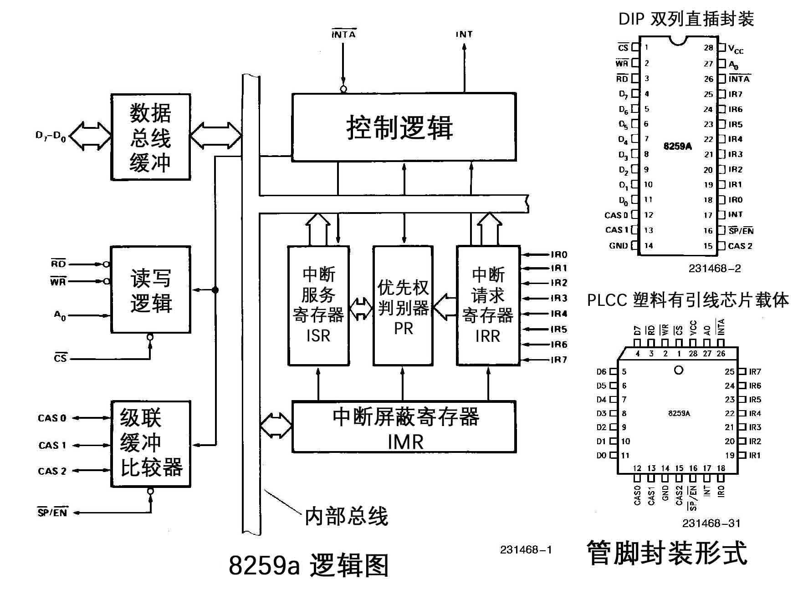

# 8259A

8259A 是 Intel 推出的一款经典的 PIC（Programmable Interrupt Controller，可编程中断控制器）芯片，用于管理计算机系统中来自外部设备的中断请求。它有 8 个中断输入引脚和 1 个中断输出引脚 INT（连接到 CPU 的 INTR 引脚）。

单个 8259A 可管理 8 路中断，多个 8259A 级联可扩展至 64 路（1 片主片 + 8 片从片）。一般使用 2 个 8259A 进行级联，一个主 8259A，一个从 8259A，从 8259A 的 INT 连接到主 8259A 的 IR2。

主 8259A：

- IR0：系统定时器。
- IR1：键盘控制器。
- IR2：级联从 8259A。
- IR3：串行端口 2/4（COM2/COM4）。
- IR4：串行端口 1/3（COM1/COM3）。
- IR5：并行端口 2（LPT2）/ 声卡。
- IR6：软盘控制器。
- IR7：并行端口 1（LPT1）。

从 8259A：

- IR0：实时时钟（Real-Time Clock，RTC）。
- IR1：软件重定向到主片的 IRQ2。
- IR2：保留。
- IR3：保留。
- IR4：PS/2 鼠标。
- IR5：浮点运算单元（Floating Point Unit，FPU），也称为协处理器。
- IR6：主 IDE 控制器。
- IR7：从 IDE 控制器。

CPU 的 FLAGS 寄存器中的 IF（Interrupt Flag，中断标志）位控制 CPU 是否响应来自 INTR 引脚的中断请求。IF为 1 时 CPU 可以响应中断，为 0 时 CPU 忽略中断。以下两条指令可以控制 IF 位：

- `cli`：将 IF 位设为 0。
- `sti`：将 IF 位设为 1。

## 内部架构

8259A 的内部结构逻辑示意图如下：

- INT：
  - 8259A → CPU。
  - 当 8259A 有可响应的中断请求时，向 CPU 发出中断请求信号。
  - 连接到 CPU 的 INTR 引脚。
- INTA：
  - 8259A ← CPU。
  - CPU 对 8259A 发出的 INT 的中断应答信号。
  - CPU 在响应中断时会发出两次INTA：1. 8259A 锁定中断源；2. 8259A 在数据总线上放出中断向量号。
- IR0~IR7：
  - 8259A ← 外设。
  - 接收来自外设的中断请求信号。
  - 可配置为边沿触发或电平触发。
- CAS0~CAS2：
  - 主8259A ↔ 从 8259A。
  - 级联 8259A 时，用于主 8259A 选择哪个从 8259A。主 8259A 在 CAS0~2 上输出从 8259A 编号，从 8259A 通过 CAS 线判断自己是否被选中。
  - 3 条线 → 最多支持 8 个从 8259A。
  - 只在级联模式下使用。
- $\overline{SP}$/$\overline{EN}$：该引脚在非缓冲/缓冲模式下含义不同。
  - 非缓存模式（$\overline{SP}$）：1 表示主 8259A，0 表示从 8259A。
  - 缓冲模式（$\overline{EN}$）：作为总线收发器使能信号，用于三态控制数据总线。
- $\overline{RD}$：CPU 从 8259A 读取内部寄存器.
- $\overline{WR}$：CPU 向 8259A 写控制命令或数据。
- A0：选择 8259A 内部寄存器。
- $\overline{CS}$：片选信号，决定 8259A 是否响应当前总线操作。
- D7~D0：数据总线。传送控制字、中断向量号等。

> 上划线 `¯` 表示低电平有效。

- IMR（Interrupt Mask Register，中断屏蔽寄存器）：控制是否屏蔽某个中断。1 表示屏蔽，0 表示不屏蔽。
- IRR（Interrupt Request Register，中断请求寄存器）：记录所有正在请求的中断。
- ISR（In-Service Register，中断服务寄存器）：记录正在被 CPU 处理的中断。

> 以上寄存器都是 8 位，每个位对应一个 IRQ。

- PR（Priority Resolver，优先权判别器）：当有多个中断同时发生，或当有新的中断请求进来时，将它与当前正在处理的中断进行比较，找出优先级更高的中断。

## 工作流程

- 外设向 8259A 发出中断请求。
- 8259A 检查 IMR，如果对应位为 1，则屏蔽该中断请求，否则将中断请求写入 IRR。
- 在某个时刻，PR 检查 IRR，挑选一个优先级最高的中断。编号小的 IRQ 优先级高。
- 8259A 向 CPU 发出中断请求信号 INT。
- 当 CPU 将当前指令执行完后，会进行中断检测，如果有正在请求的中断，并且 IF 位为 1，则向 8259A 发出中断应答信号 INTA。8259A 收到 INTA 后，将挑选出来的优先级最高的中断在 ISR 中对应位置为 1，同时在 IRR 中对应位置为 0。
- CPU 再次向 8259A 发出中断应答信号 INTA，8259A 在数据总线上放出中断向量号。起始中断向量号 + IRQ 接口号就是该中断的中断向量号。
- CPU 从数据总线上拿到该中断向量号后，用它做中断向量表或中断描述符表中的索引，找到相应的中断处理程序井去执行。
- 如果 8259A 的 EOI（End of Interrupt，中断结束）通知被设置为非自动模式（手工模式），中断处理程序结束前必须向 8259A 发送 EOI。
- 8259A 在收到 EOI 后，将当前正处理的中断在 ISR 中对应的位置为 0。
- 如果 EOI 通知被设置为自动模式，在刚才 8259A 接收到第二个 INTA 信号后，也就是 CPU 向 8259A 要中断向量号的那个 INTA, 8259A 会自动将此中断在 ISR 中对应的位置为 0。
- 并不是进入了 ISR 后的中断就可以被 CPU 处理了，它还是有可能被后者换下来的。比如，在 8259A 发送中断向量号给 CPU 之前，这时候又来了新的中断，如果它的来源 IRQ 接口号比 ISR 中的低，也就是优先级更高，原来 ISR 中准备上 CPU 处理的旧中断，其对应的位就得清 0，同时将它所在的 IRR 中的相应位恢复为 1，随后在 ISR 中将此优先级更高的新中断对应的位设为 1，然后将此新中断的中断向量号发给 CPU。如果新来的中断优先级较低，依然会被放进 IRR 寄存器中等待处理。

## I/O 端口

8259A 有两个端口，主 8259A 的端口地址为 0x20 和 0x21，从 8259A 的端口地址为 0xA0 和 0xA1。

8259A 内部有两组寄存器：

- 初始化命令字（Initialization Command Word，ICW）寄存器组：ICW1~ICW4。
- 操作命令字（Operation Command Word, OCW）寄存器组：OCW1~OCW3。

ICW1，OCW2，OCW3 是用偶地址端口写入。主 8259A 的 `0x20`，从 8259A 的 `0xA0`。

ICW2~ICW4 和 OCW1 是用奇地址端口写入。主 8259A 的 `0x21`，从 8259A 的 `0xA1`。

以上 4 个 ICW 要保证一定的次序写入，8259A 就知道写入端口的数据是什么了。

OCW 的写入与顺序无关，并且 ICW1 和 OCW2, OCW3 的写入端口是一致的，8259A 怎样来辨识它们呢?

其实就是通过各控制字中的第 4~3 标识位，通过这两位的组合来唯一确定某个控制字，如下表；

| 控制字 | 第 4 位 | 第 3 位 |
| ------ | ------- | ------- |
| ICW1   | 1       | /       |
| OCW2   | 0       | 0       |
| OCW3   | 0       | 1       |

OCW1 是怎样确定的呢？

OCW 是在初始化之后才有效的，所以在初始化之后写入奇地址端口的数据便被认为是 OCW1。

### ICW1 连接 / 触发方式

ICW1 用来初始化 8259A 的 **连接方式** 和中断信号的 **触发方式**。

- 连接方式是指用单片工作，还是用多片级联工作。
- 触发方式是指中断请求信号是电平触发，还是边沿触发。

如下表所示，共一个字节；

| 7   | 6   | 5   | 4   | 3    | 2   | 1     | 0   |
| --- | --- | --- | --- | ---- | --- | ----- | --- |
| 0   | 0   | 0   | 1   | LTIM | ADI | SINGL | IC4 |

- IC4 表示是否要写入 ICW4，这表示并不是所有的 ICW 都需要用到。IC4 为 1 时表示需要在后面写入 ICW4 ，为 0 时表示不需要。注意，x86 系统 IC4 必须为1
- SNGL 表示 Single。若 SNGL 为 1 ，表示单片，若 SNGL 为 0，表示级联（Cascade）。若在级联模式下，这要涉及到主片和从片用哪个 IRQ 接口互相连接的问题，所以当 SNGL 为 0 时，主片和从片也是需要 ICW3 的。
- ADI 表示 Call Address Interval，用来设置 8085 的调用时间间隔，x86 不需要设置。
- LTIM 表示 Level/Edge Triggered Mode，用来设置中断检测方式，LTIM 为 0 表示边沿触发，LTIM 为 1 表示电平触发。
- 第 4 位的 1 是固定的，这是 ICW1 的标记。
- 第 5~7 位专用于 8085 处理器，x86 不需要，直接置为 0 即可。

### ICW2 起始中断向量号

ICW2 用来设置 **起始中断向量号**，一般为 `0x20`，如下表所示，共一个字节：

| 7   | 6   | 5   | 4   | 3   | 2   | 1   | 0   |
| --- | --- | --- | --- | --- | --- | --- | --- |
| T7  | T6  | T5  | T4  | T3  | ID2 | ID1 | ID0 |

由于每个 8259A 芯片上的 IRQ 接口是顺序排列的，所以咱们这里的设置就是指定 IRQ0 映射到的中断向量号，其他 IRQ 接口对应的中断向量号会顺着自动排列下去。

由于咱们只需要设置 IRQ0 的中断向量号， IRQ1~IRQ7 的中断向量号是 IRQ0 的顺延，所以，只需填写高 5 位 T3~T7，ID0~ID2 这低 3 位不用填。

由于只填写高 5 位，所以任意数字都是 8 的倍数，这个数字表示的便是设定的起始中断向量号。

这是有意设计的，低 3 位能表示 8 个中断向量号，这由 8259A 根据 8 个 IRQ 接口的排列位次自行导入，IRQ0 的值是 000, IRQ1 的值是001, IRQ2 的值便是 010... 以此类推，这样高 5 位加低 3 位，便表示了任意一个 IRQ 接口实际分配的中断向量号。

### ICW3 级联方式

ICW3 仅在 **级联的方式** 下才需要（如果 ICW1 中的 SNGL 为 0），用来设置主片和从片用哪个 IRQ 接口互连。

由于主片和从片的级联方式不一样，对于这个 ICW3，主片和从片都有自己不同的结构。

对于主片，ICW3 中置 1 的那一位对应的 IRQ 接口用于连接从片，若为 0 则表示接外部设备。比如，若主片 IRQ2 和 IRQ5 接有从片，则主片的 ICW3 为 00100100。

主片如下表所示，共一个字节；

| 7   | 6   | 5   | 4   | 3   | 2   | 1   | 0   |
| --- | --- | --- | --- | --- | --- | --- | --- |
| S7  | S6  | S5  | S4  | S3  | S2  | S1  | S0  |

对于从片，要设置与主片 8259A 的连接方式，不需要指定用自己的哪个 IRQ 接口与主片连接，从片上专门用于级联主片的接口并不是 IRQ。

从片如下表所示，共一个字节；

| 7   | 6   | 5   | 4   | 3   | 2   | 1   | 0   |
| --- | --- | --- | --- | --- | --- | --- | --- |
| 0   | 0   | 0   | 0   | 0   | ID2 | ID1 | ID0 |

如果从片用 IRQ 接口连接主片，若主片只级联一个从片，在从片上指定的 IRQ 接口便默认与主片上做级联的那个 IRQ 接口匹配了。但如果主片级联多个从片时，在从片上还要设置自己用于连接主片的 IRQ 接口与主片上连接从片的哪个 IRQ 接口（有多个）对接，这反而更麻烦。**所以，设置从片连接主片的方法是只需要在从片上指定主片用于连接自己的那个 IRQ 接口就行了。**

在中断响应时，主片会发送与从片做级联的 IRQ 接口号，所有从片用自己的 ICW3 的低 3 位和它对比，若一致则认为是发给自己的。

比如主片用 IRQ2 接口连接从片 A，用 IRQ5 接口连接从片 B；从片 A 的 ICW3 的值应该设为 0b00000010，就是十进制数 2，从片 B 的 ICW3 的值应该设为 0b00000101，就是十进制数 5；所以，从片 ICW3 中的低 3 位 ID0~ID2 就够了，高 5 位不需要，为 0 即可。

### ICW4 工作模式

ICW4 用于设置 8259A 的 **工作模式**，当 ICW1 中的 IC4 为 1 时才需要 ICW4。

如下表所示，共一个字节；

| 7   | 6   | 5   | 4    | 3   | 2   | 1    | 0   |
| --- | --- | --- | ---- | --- | --- | ---- | --- |
| 0   | 0   | 0   | SFNM | BUF | M/S | AEOI | μPM |

- 第 7~5 位未定义，直接置为 0 即可。
- SFNM 表示特殊全嵌套模式（Special Fully Nested Mode），若 SFNM 为 0，则表示全嵌套模式，若 SFNM 为 1，则表示特殊全嵌套模式。
- BUF 表示本 8259A 芯片是否工作在缓冲模式。BUF 为 0 ，则工作非缓冲模式，BUF 为 1 ，则工作在缓冲模式。
- M/S 用于指定主片和从片；当多个 8259A 级联时，如果工作在缓冲模式下（BUF = 1），若 M/S 为 1 ，则表示则表示是主片，若 M/S 为0，则表示是从片。若工作在非缓冲模式下（BUF = 0）， M/S 无效。
- AEOI 表示自动结束中断（Auto End Of Interrupt），8259A 在收到中断结束信号时才能继续处理下一个中断，此项用来设置是否要让 8259A 自动把中断结束。
  - 若 AEOI 为 0 ，则表示非自动，即手动结束中断，可以在中断处理程序中手动向 8259A 的主、从片发送 EOI 信号。这种 **操作** 类命令，通过下面要介绍的 OCW 进行。
  - 若 AEOI 为 1 ，则表示自动结束中断。
- μPM 表示微处理器类型（microprocessor），此项是为了兼容老处理器。若 μPM 为 0，则表示 8080 或 8085 处理器，若 μPM 为1 ，则表示 x86 处理器。

### OCW1 屏蔽字

OCW1 用来屏蔽连接在 8259A 上的外部设备的中断信号，如下表所示，共一个字节；

| 7   | 6   | 5   | 4   | 3   | 2   | 1   | 0   |
| --- | --- | --- | --- | --- | --- | --- | --- |
| M7  | M6  | M5  | M4  | M3  | M2  | M1  | M0  |

实际上就是把 OCW1 写入了即 IMR 寄存器。这里的屏蔽是说是否把来自外部设备的中断信号转发给 CPU。由于外部设备的中断都是可屏蔽中断，所以最终还是要受标志寄存器 eflags 中的 IF 位的管束，若 IF 为 0，可屏蔽中断全部被屏蔽，也就是说，在 IF 为 0 的情况下，即使 8259A 把外部设备的中断向量号发过来，CPU 也置之不理。

### OCW2 结束方式

OCW2 用来设置中断结束方式和优先级模式，如下表所示，共一个字节；

| 7   | 6   | 5   | 4   | 3   | 2   | 1   | 0   |
| --- | --- | --- | --- | --- | --- | --- | --- |
| R   | SL  | EOI | 0   | 0   | L2  | L1  | L0  |

高 3 位 R、SL、EOI 可以定义多种 **中断结束方式** 和 **优先级循环方式**。

- R（Rotation），表示是否按照循环方式设置中断优先级。R 为 1 表示优先级自动循环， R 为 0 表示不自动循环，采用固定优先级方式。
  - 如果 R 为 0，表示固定优先级方式，即 IRQ 接口号越低，优先级越高。
  - 如果 R 为 1，表明用循环优先级方式，这样优先级会在 0~7 内循环，具体解释见下文；
- SL（Specific Level），表示是否指定优先等级。等级是用低 3 位来指定的。此处的 SL 只是开启低 3 位的开关，所以 SL 也表示低3 位的 L2~L0 是否有效。SL 为 1 表示有效，SL 为 0 表示无效。
- EOI（End Of Interrupt），为中断结束命令位。令 EOI 为 1，则会令 ISR 寄存器中的相应位清 0，也就是将当前处理的中断清掉，表示处理结束。向 8259A 主动发送 EOI 是手工结束中断的做法，所以，使用此命令有个前提，就是 ICW4 中的 AEOI 位为 0，非自动结束中断时才用。
在手动结束中断（AEOI 位为 0）的情况下，如果中断来自主片，只需要向主片发送 EOI 就行了，如果中断来自从片，除了向从片发送 EOI 以外，还要再向主片发送 EOI。
- 第 4~3 位的 00 是 OCW2 的标识。
- L2~L0 用来确定优先级的编码，这里分两种：
  - 用于 EOI 时，表示被中断的优先级别。
  - 用于优先级循环时，指定起始最低的优先级别。

优先级循环方式的解释：

首先 R 必须是 1；

如果 SL 为 0，初始的优先级次序为：

IR0 > IR1 > IR2 > IR3 > IR4 > IR5 > IR6 > IR7。

当某级别的中断被处理完成后，它的优先级别将变成最低，将最高优先级传给之前较之低一级别的中断请求，其他依次类推。所以，可循环方式多用于各中断源优先级相同的情况，优先级通过这种循环可以实现轮询处理。该循环可总结为如果循环优先级 IR(i) 优先级最低，则 IR(i + 1) 优先级最高。

如果 SL 为 1，若想指定 IR5 为最低的优先级，需要将 L2~L0 置为 101。这样，新的初始优先级循环是：

IR6 > IR7 > IR0 > IR1 > IR2 > IR3 > IR4 > IR5。

### OCW3 特殊 / 查询方式

OCW3 用来设定特殊屏蔽方式及查询方式，如下表所示，共一个字节；

| 7   | 6    | 5   | 4   | 3   | 2   | 1   | 0   |
| --- | ---- | --- | --- | --- | --- | --- | --- |
| /   | ESMM | SMM | 0   | 1   | P   | RR  | RIS |

- 第 7 位未用到。
- ESMM（Enable Special Mask Mode）和 SMM（Special Mask Mode）是组合在一起用的，用来启用或禁用特殊屏蔽模式。ESMM 是特殊屏蔽模式允许位，是个开关。SMM 是特殊屏蔽模式位。只有在启用特殊屏蔽模式时，特殊屏蔽模式才有效。也就是若 ESMM 为 0，则 SMM 无效。若 ESMM 为 1，SMM 为 0，表示未工作在特殊屏蔽模式。若 ESMM 和 SMM 都为 1，这才正式工作在特殊屏蔽模式下。
- 第 4~3 位的 01 是 OCW3 的标识，8259A 通过这两位判断是哪个控制字。
- P（Poll command），查询命令，当 P 为 1 时，设置 8259A 为中断查询方式，这样就可以通过读取寄存器，如 IRS，来查看当前的中断处理情况。
- RR（Read Register）读取寄存器命令。它和 RIS 位是配合在一起使用的。当 RR 为 1 时才可以读取寄存器。
- RIS（Read Interrupt register Select）读取中断寄存器选择位，顾名思义，就是用此位选择待读取的寄存器。有点类似显卡寄存器中的索引的意思。若 RIS 为 1，表示选择 ISR 寄存器，若 RIS 为 0，表示选择 IRR 寄存器。这两个寄存器能否读取，前提是 RR 的值为 1。
