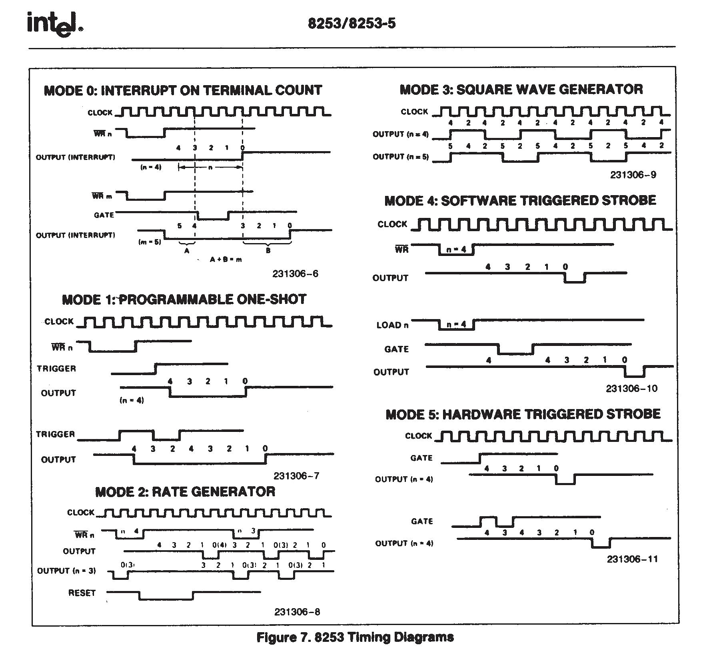

# PIT

PIT（Programmable Interval Timer，可编程间隔定时器）是计算机系统中的一个定时器，用于产生周期性的中断信号。

Intel 8254（及其前身 8253）是最经典、最广为人知的 PIT 芯片，其输入时钟的频率为 1.193182 MHz，内部有 3 个独立的计数器（也可称为通道），分别是计数器 0 ~ 2。每个计数器完全相同，都是 16 位大小，相互独立，互不干涉。

- 计数器 0：系统定时器。连接到 IRQ0，专门用于产生周期性时钟中断。这是操作系统“心跳”的来源。
- 计数器 1：DRAM 刷新定时器。历史用途，用于定时触发内存刷新周期。
- 计数器 2：扬声器音调发生器。用于驱动 PC 喇叭产生不同频率的声音（蜂鸣声）。

I/O 端口：

- 0x40~0x43：计数器 0~2 的数据端口，存储了定时器计数值。
- 0x43：控制字寄存器，用于设置工作方式等。控制字是 8 位的，格式如下：

    | 7   | 6   | 5   | 4   | 3   | 2   | 1   | 0   |
    | --- | --- | --- | --- | --- | --- | --- | --- |
    | SC1 | SC0 | RL1 | RL0 | M2  | M1  | M0  | BCD |

  - 位 7~6: 计数器选择位。
    - 00：计数器 0。
    - 01：计数器 1。
    - 10：计数器 2。
    - 11：无效。

  - 位 5~4: 读写操作位。
    - 00：锁存计数值，供 CPU 读。
    - 01：只读写低字节。
    - 10：只读写高字节。
    - 11：先读写低字节，后读写高字节。

  - 位 3~1: 工作方式选择位。
    - 000：模式 0 —— 中断产生。
    - 001：模式 1 —— 可重触发的单稳态。
    - x10：模式 2 —— 速率发生器。
    - x11：模式 3 —— 方波发生器。
    - 100：模式 4 —— 软件触发。
    - 101：模式 5 —— 硬件触发。

    

  - 位 0：
    - 0：二进制计数器。
    - 1：BCD（Binary-Coded Decimal，二进制编码的十进制）计数器。
