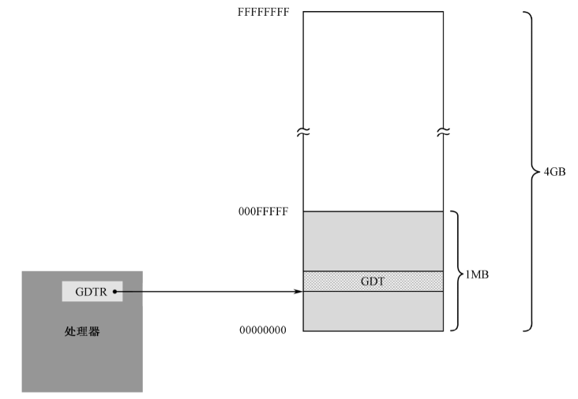
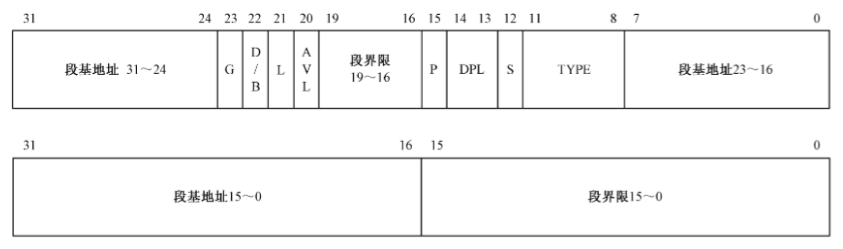

# 保护模式

## 全局描述符表

- 全局描述符表（Global Descriptor Table，GDT）本质上是一个存储在内存中的描述符数组，每个描述符（8 字节）定义了一个内存段的属性。
- CPU 通过 GDTR 寄存器指向这张表。
- 理论上，全局描述符表可以位于内存中的任何地方。但是，由于在进入保护模式之后，处理器要立即按新的内存访问模式工作，所以，必须在进入保护模式之前定义 GDT。但是，由于在实模式下只能访问 1MB 的内存，故 GDT 通常都定义在 1MB 以下的内存范围中。当然，允许在进入保护模式之后换个位置重新定义 GDT。
- 处理器规定，GDT 中的第一个描述符必须是空描述符，或者叫“哑描述符”​、NULL 描述符。



## GDTR

一个 48 位的寄存器，其中高 32 位是 GDT 的基地址，低 16 位是 GDT 的界限（表的大小 - 1）。

```c
typedef struct pointer
{
    unsigned short limit; // size - 1
    unsigned int base;
} __attribute__((packed)) pointer;
```

```asm
lgdt [gdt_ptr]; 加载 gdt
sgdt [gdt_ptr]; 保存 gdt
```

因为 GDT 的界限是 16 位的，所以，该表最大是 2^16 字节，也就是 65536 字节(64 KB)。又因为一个描述符占 8 字节，故最多可以定义 8192 个描述符。

## 描述符

每个描述符在 GDT 中占 8 字节，也就是 2 个双字，或者说是 64 位。其结构如下：



```c
typedef struct descriptor /* 共 8 个字节 */
{
    unsigned short limit_low;      // 段界限 0 ~ 15 位
    unsigned int base_low : 24;    // 段基地址 0 ~ 23 位
    unsigned char type : 4;        // 段类型
    unsigned char segment : 1;     // 1 表示代码段或数据段，0 表示系统段
    unsigned char DPL : 2;         // Descriptor Privilege Level，描述符特权等级 0 ~ 3。0 表示最高特权级，3 表示最低特权级
    unsigned char present : 1;     // 存在位，0 表示在磁盘上，1 表示在内存中
    unsigned char limit_high : 4;  // 段界限 16 ~ 19 位
    unsigned char available : 1;   // 该安排的都安排了，送给操作系统吧
    unsigned char long_mode : 1;   // 64 位扩展标志
    unsigned char big : 1;         // 32 位还是 16 位，0 表示 16 位，1 表示 32 位
    unsigned char granularity : 1; // 粒度，0 表示段界限以 1B 为单位，1 表示 段界限以 4KB 为单位
    unsigned char base_high;       // 段基地址 24 ~ 31 位
} __attribute__((packed)) descriptor;
```

- TYPE（S = 1）：

    | X | C/E | R/W | A |

  - X：是否可执行。
  - X = 1：可以执行，代码段。
    - C: 是否为特权级依从的。0 表示非依从的代码段，这样的代码段可以从与它特权级相同的代码段调用，或者通过门调用，1 表示允许从低特权级的程序转移到该段执行。
    - R: 是否可读。0 表示不可读，1 表示可读。
  - X = 0: 不可以执行，数据段。
    - E: 指示段的扩展方向。0 表示向上扩展（普通的数据段），1 表示向下扩展（栈段）。
    - W: 是否可写。0 表示只读，1 表示可读写。
  - A: 是否被 CPU 访问过。0 表示未被访问过，1 表示已被访问过。

## 段选择子

```cpp
typedef struct selector
{
    unsigned char RPL : 2; // Request Privilege Level，请求特权级
    unsigned char TI : 1; // 0 表示全局描述符，1 表示局部描述符 
    unsigned short index : 13; // 全局描述符表索引
} __attribute__((packed)) selector;
```

## A20 线

实模式下的程序只能寻址 1M B内存，那是因为它依赖 16 位的段地址左移 4 位，加上 16 位的偏移地址来访问内存。当逻辑段地址达到最大值 0xFFFF 时，再加 1，就会因进位而绕回到 0x0000，因为段寄存器只能保留 16 位的结果。

其实问题的解决办法很简单，只需要强制第 21 根地址线恒为“0”就可以了。

可以通过将输入输出控制器集中芯片（ I/O Controller Hub，ICH）的 0x92 端口的第 1 位置为 1 来打开 A20 线。

## CR0

CR0 是 32 位的寄存器，包含了一系列用于控制处理器操作模式和运行状态的标志位。它的第1位（位0）是保护模式允许位（Protection Enable, PE），如果把该位置“1”​，则处理器进入保护模式，按保护模式的规则开始运行。

## 关中断

保护模式下的中断机制和实模式不同，因此，原有的中断向量表不再适用，而且，必须要知道的是，在保护模式下，BIOS 中断都不能再用，因为它们是 16 位的代码。在重新设置保护模式下的中断环境之前，必须关中断。
