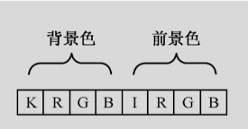
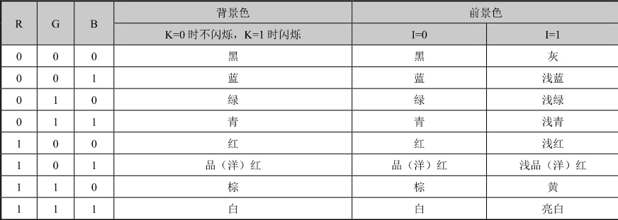

# 文本显示

在80×25 彩色文本模式下，显卡的文本显存被映射到物理地址空间 0xB8000 ~ 0xBFFFF，总容量为 32KB。

屏幕以字符为单位进行显示：

- 每行 80 个字符。
- 共 25 行。
- 总计 80 × 25 = 2000 个字符。

在显存中，每个字符占用连续的 2 个字节：

1. 第 1 个字节：字符的 ASCII 码。
2. 第 2 个字节：字符的显示属性。

因此，完整显示一屏文本所需的显存大小为：

> 2000 × 2 = 4000 字节（约 4KB）

## ASCII 码

ASCII 码用于表示字符本身。

## 显示属性

显示属性字节用于控制字符的显示效果。

## 其他

如果需要控制光标位置、显示起始地址等显示行为，则需要操作 CRTC（Cathode Ray Tube Controller，阴极射线管控制器）。其常用 I/O 端口如下：

- CRT 索引寄存器：`0x3D4` —— 向该寄存器写入目标寄存器的索引值，以此选中需要操作的 CRTC 寄存器。
- CRT 数据寄存器：`0x3D5` —— 通过该寄存器读写选中的 CRTC 寄存器。

常用寄存器索引：

- 光标位置高字节：`0x0E`。
- 光标位置低字节：`0x0F`。
- 显示起始地址高字节：`0x0C`。
- 显示起始地址低字节：`0x0D`。
